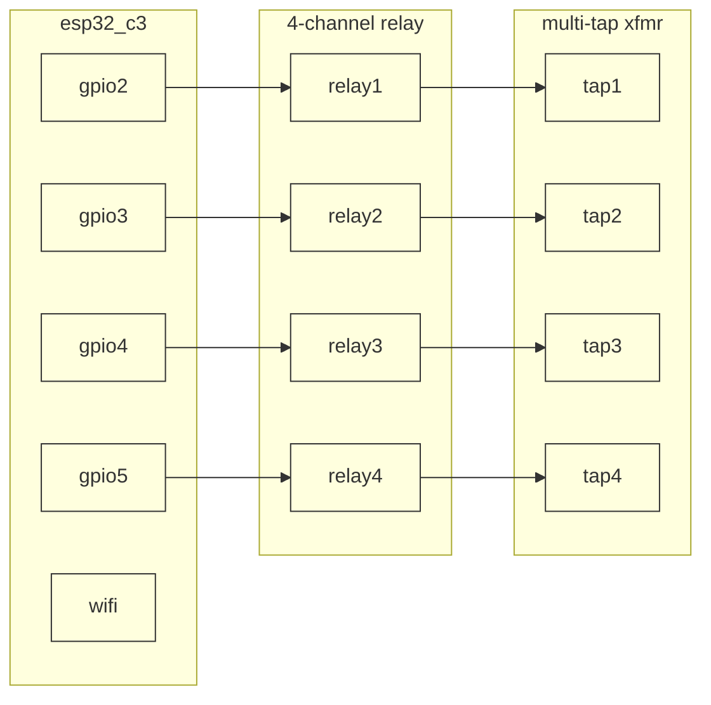

# DLR PST Sim ⚡🔄


> ESP32-C3 firmware (Embassy async runtime): publishes temperature telemetry
> over MQTT, subscribes to the DLR dynamic line rating from
> `dlr-operating-envelope`, and runs a software tap-position control loop
> that decides + publishes a transformer tap decision. Physical relay/
> transformer actuation is not wired up yet — see [Current Scope](#current-scope).

## Current Scope

**Built + tested today:**
- Real WiFi (esp-wifi/embassy-net) + real MQTT v5 (rust-mqtt, no_std) on the ESP32-C3.
- Publishes an I2C temperature reading (°F) every tick.
- Subscribes to the DLR dynamic line rating; a pure, unit-tested state
  machine (`src/tap_control.rs`) maps the rating to one of 4 tap positions
  and steps toward it gradually (one position per tick, to avoid voltage
  spikes) — see [Tap Control Logic](#tap-control-logic).
- Publishes the resulting tap-position decision over MQTT.
- Hardware-in-loop test (`tests/hil_test.rs`) flashes real firmware to a
  physical ESP32-C3 and verifies the MQTT round-trip on real hardware.

**Not built yet (no relay/transformer hardware on hand):**
- No GPIO relay actuation — the tap-position decision is computed and
  published, not physically applied to a transformer.
- No OTA firmware update path.

## Pre-requisites

- rust 1.93+
- probe-rs (`cargo install probe-rs-tools`)
- ESP32-C3 development board
- I2C temperature sensor (shtcx-compatible)

**For the future physical tap-actuation phase (not required today):**
- 4-channel relay module
- Multi-tap transformer

## Hardware

| Component | Purpose | Interface | Status |
|---|---|---|---|
| ESP32-C3 | Microcontroller | WiFi + MQTT | Built |
| I2C temp sensor | Telemetry source | I2C | Built |
| 4-Channel Relay | Tap switching | GPIO | Not wired — no hardware on hand |
| Multi-tap Transformer | Voltage adjustment | AC | Not wired — no hardware on hand |

## Pinout (target — not yet wired)

The relay/transformer wiring below is the intended physical actuation
layer once that hardware is sourced. Today the firmware computes and
publishes a tap decision but drives no GPIOs for it.



## MQTT Topics

**Current (provisional, matches what's actually on the wire today):**

| Direction | Topic | Payload |
|---|---|---|
| Publish | `test/temp/F` | raw float string |
| Subscribe | `test/line_rating/A` | raw float string — matches `dlr-operating-envelope/src/mqtt.py::MQTT_TOPIC` as published today |
| Publish | `test/tap_position` | tap label string (`TAP_1`..`TAP_4`) |

**Target contract** per [ems/topic_structure_adr.md](../ems/topic_structure_adr.md)
(`FloatSample {ts, value}` / `EnumSample {ts, value}`) — documented as the
destination, not yet implemented on either this repo or
`dlr-operating-envelope`'s publish side:

- `sites/{site_id}/devices/{dlr_device_id}/measurements/dynamic_rating/amps`
- `sites/{site_id}/devices/{device_id}/commands/set/tap_position/none` — `EnumSample`
- `sites/{site_id}/devices/{device_id}/measurements/output_voltage/volts`
- `sites/{site_id}/devices/{device_id}/measurements/tap_position/none` — `EnumSample`
- `sites/{site_id}/devices/{device_id}/measurements/status/none` — `EnumSample`, LWT-backed

Migrating both repos to the ADR topic/payload contract is tracked as a
follow-up — it touches `dlr-operating-envelope`'s currently-green
hardware-in-loop pipeline, so it gets its own change.

## Tap Control Logic

`src/tap_control.rs` maps the dynamic rating to a tap position:

- Higher rating → lower tap (higher voltage)
- Lower rating → higher tap (lower voltage)
- Gradual adjustments (one tap position per tick) to prevent voltage spikes

Band edges are derived from the actual IEEE 738 output range
`dlr-operating-envelope`'s sim sensors produce over one sawtooth-sweep
cycle for the DRAKE_ACSR_795 conductor, not arbitrary guesses — see the
doc comment in `src/tap_control.rs`.

## Project Structure

```
├── Cargo.toml                      # package, features, target config
├── rust-toolchain.toml             # pinned 1.98.0
├── build.rs                        # compile-time cfg.yml baking
├── cfg.yml                         # wifi_ssid, mqtt_host per env
├── .cargo/config.toml               # probe-rs runner + target
├── src/
│   ├── main.rs                     # entry point
│   ├── app.rs                      # library — embassy tasks + main loop
│   ├── network.rs                  # WiFi + embassy-net setup
│   ├── mqtt.rs                     # MQTT pub/sub client
│   ├── tap_control.rs              # rating -> tap-position state machine
│   ├── tap_control_test.rs         # unit tests (host, no hardware)
│   └── temperature/
│       ├── mod.rs
│       ├── temperature_client.rs
│       ├── temperature_client_test.rs
│       └── temperature_driver.rs
└── tests/
    ├── integration_test.rs         # on-device embedded-test suite
    ├── hil_test.rs                 # flash firmware + verify MQTT round-trip
    └── fixtures/                   # testcontainer helpers
```

### Testing Strategy

1. **Unit** — `*_test.rs` colocated per module, run on host via `cargo cmd unit`
2. **Integration** — `integration_test.rs` runs on-device via embedded-test + probe-rs
3. **Hardware-in-loop** — `hil_test.rs` flashes firmware, starts a testcontainer MQTT broker, verifies the subscribe/publish loop on real hardware

## Usage

```bash
# Build + flash firmware
cargo build --bin=dlr-pst-sim --release

# Run on-device integration tests
cargo cmd integration

# Run hardware-in-loop tests (requires device on USB + testcontainers)
cargo cmd hardware-in-loop

# Monitor RTT output
probe-rs attach --chip esp32c3
```
