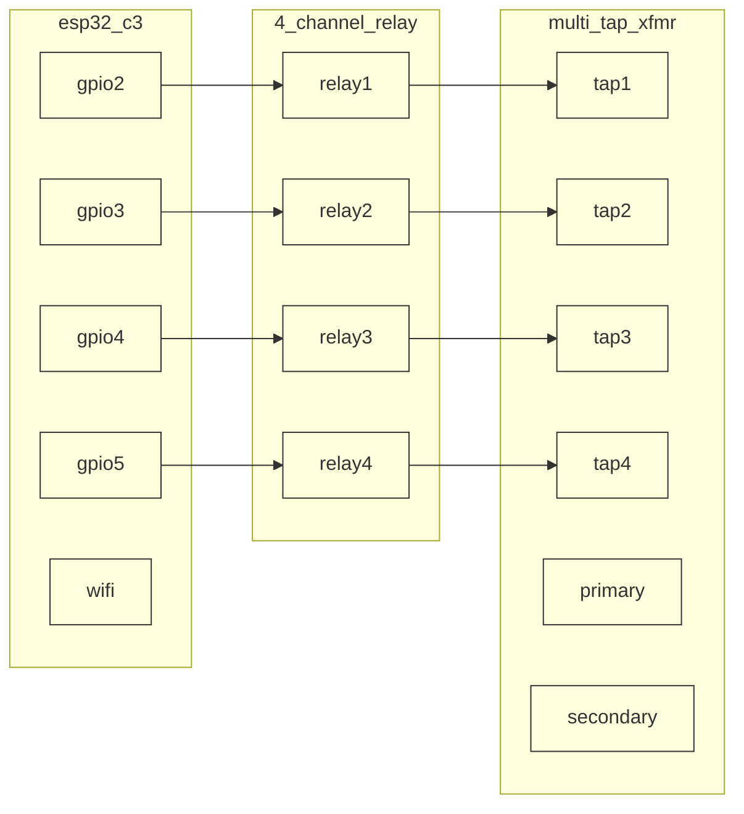

# EMS Line Controller PST ⚡🔄


> Embedded transformer tap control using Embassy-rs async runtime

## Pre-requisites
- rust 1.93+
- ESP32-C3 development board
- 4-channel relay module

## Hardware

| Component | Purpose | Interface |
|-----------|---------|-----------|
| ESP32-C3 | Microcontroller | WiFi/MQTT |
| 4-Channel Relay | Tap switching | GPIO |
| Multi-tap Transformer | Voltage adjustment | AC |

## Pinout



## MQTT Topics

**Subscribed:**
- `sites/{site_id}/devices/dlr_sensor/calculations/amps/{dynamic_rating}`

**Published:**
- `sites/{site_id}/devices/pst/measurements/volts/{output_voltage}`
- `sites/{site_id}/devices/pst/status/{tap_position}`

## Project Structure
```
├── Cargo.toml               # Dependencies and build config
├── src/
│   ├── main.rs              # Application entry point
│   ├── app.rs               # Main application logic (exported for testing)
│   ├── mqtt_client.rs       # MQTT subscriber/publisher
│   ├── mqtt_client_test.rs  # MQTT client tests
├── relay_control/
│   ├── relay_control_client_test.rs
│   ├── relay_control_client.rs
│   ├── relay_control_driver.rs
│   └── mod.rs
├── transformer/
│   ├── transformer_client_test.rs
│   ├── transformer_client.rs
│   ├── transformer_driver.rs
│   └── mod.rs

│   └── config.rs            # WiFi and MQTT configuration
├── tests/
│   └── integration.rs       # Hardware integration tests (imports app.rs)
├── .cargo/
│   └── config.toml          # ESP32 build configuration
└── README.md                # This file
```

### Testing Strategy
1. **Unit Tests**: Colocated `*_test.rs` files test individual modules
2. **Integration Tests**: `integration.rs` imports main function from `app.rs` for end-to-end testing
3. **Embassy-rs**: Async runtime enables concurrent MQTT and GPIO operations

## Usage

```bash
# Install probe-rs
cargo install probe-rs-tools

# Build and flash
cargo run --release

# Debug with probe-rs
probe-rs run --chip esp32c3

# Monitor serial output
probe-rs attach --chip esp32c3
```

## Tap Control Logic

The transformer adjusts tap position based on dynamic rating:
- Higher rating → Lower tap (higher voltage)
- Lower rating → Higher tap (lower voltage)
- Gradual adjustments to prevent voltage spikes
