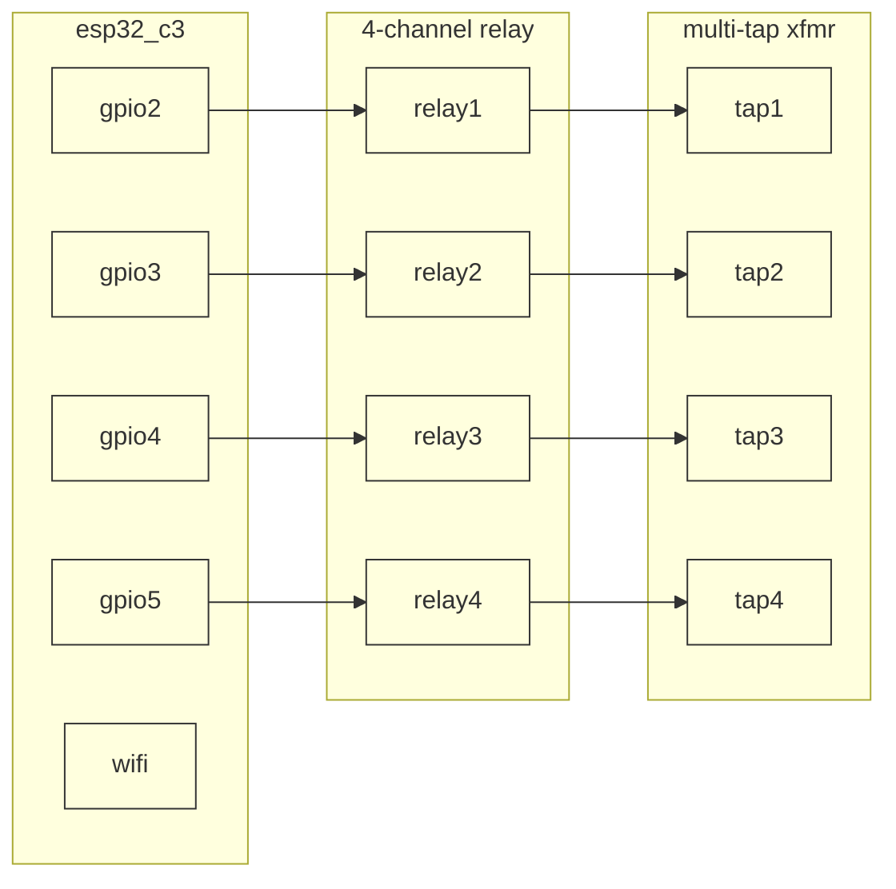

# DLR PST Sim ⚡🔄


> Embedded transformer tap control on ESP32-C3 using Embassy async runtime. Subscribes to DLR ratings over MQTT, actuates relays to switch transformer taps, publishes output state.

## Pre-requisites

- rust 1.93+
- probe-rs (`cargo install probe-rs-tools`)
- ESP32-C3 development board
- 4-channel relay module
- Multi-tap transformer

## Hardware

| Component | Purpose | Interface |
|---|---|---|
| ESP32-C3 | Microcontroller | WiFi + MQTT |
| 4-Channel Relay | Tap switching | GPIO |
| Multi-tap Transformer | Voltage adjustment | AC |

## Pinout



## MQTT Topics

Per [ems/topic_structure_adr.md](../ems/topic_structure_adr.md). Payload is `FloatSample {ts, value}` unless noted.

**Subscribed:**
- `sites/{site_id}/devices/{dlr_device_id}/measurements/dynamic_rating/amps`
- `sites/{site_id}/devices/{device_id}/commands/set/tap_position/none` — `EnumSample`

**Published:**
- `sites/{site_id}/devices/{device_id}/measurements/output_voltage/volts`
- `sites/{site_id}/devices/{device_id}/measurements/tap_position/none` — `EnumSample`
- `sites/{site_id}/devices/{device_id}/measurements/status/none` — `EnumSample`, LWT-backed

## Tap Control Logic

The transformer adjusts tap position based on the dynamic rating received from `dlr-utility-envelope`:

- Higher rating → lower tap (higher voltage)
- Lower rating → higher tap (lower voltage)
- Gradual adjustments to prevent voltage spikes

## Project Structure

```
├── Cargo.toml                 # package, features, target config
├── rust-toolchain.toml        # pinned 1.93.0
├── build.rs                   # compile-time cfg.yml baking
├── cfg.yml                    # wifi_ssid, mqtt_host per env
├── .cargo/config.toml         # probe-rs runner + target
├── src/
│   ├── main.rs                # entry point
│   ├── app.rs                 # library — embassy tasks
│   ├── network.rs             # WiFi + embassy-net setup
│   ├── mqtt.rs                # MQTT pub/sub client
│   ├── config.rs              # cfg.yml loader
│   ├── relay/
│   │   ├── mod.rs
│   │   ├── relay_driver.rs    # GPIO actuation
│   │   ├── relay_client.rs    # high-level relay API
│   │   └── relay_client_test.rs
│   └── transformer/
│       ├── mod.rs
│       ├── transformer_driver.rs    # tap position state machine
│       ├── transformer_client.rs    # high-level tap control
│       └── transformer_client_test.rs
└── tests/
    ├── integration_test.rs    # on-device embedded-test suite
    ├── hil_test.rs            # flash firmware + verify MQTT round-trip
    └── fixtures/              # testcontainer helpers
```

### Testing Strategy

1. **Unit** — `*_test.rs` colocated per module, run on host via `cargo cmd unit`
2. **Integration** — `integration_test.rs` runs on-device via embedded-test + probe-rs
3. **Hardware-in-loop** — `hil_test.rs` flashes firmware, starts a testcontainer MQTT broker, verifies the full subscribe/publish loop

## Usage

```bash
# Build + flash firmware
cargo build --bin=dlr-pst-sim --release

# Run on-device integration tests
cargo cmd integration

# Run hardware-in-loop tests (requires device on USB + testcontainers)
cargo cmd hardware-in-loop

# Monitor RTT output
probe-rs attach --chip esp32c3
```
